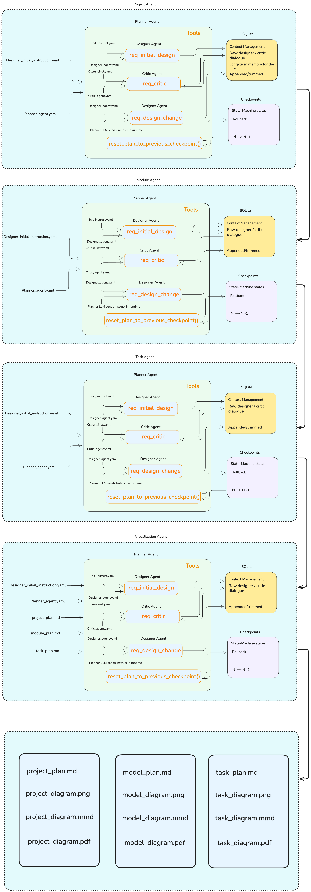

# AgenticPMS

`AgenticPMS` is an autonomous, fault-tolerant hierarchical agentic system that transforms high-level project briefs into execution-ready roadmaps through a pipeline: **project** → **module** → **task** → **visualization**. Each stage is handled by a specialized agent that uses an internal planner/designer/critic loop to refine outputs before passing them to the next level.

---

## What This Project Is

AgenticPMS takes a project description (e.g., "Build a customer analytics dashboard") and produces:

- **Project plan** — High-level components, boundaries, and dependencies
- **Module plan** — Module structure per component (no tasks yet)
- **Task plan** — Concrete tasks per module, ready for execution
- **Visualization** — Mermaid diagrams (and PNG/PDF) per plan: project, module, and task

The system is **autonomous**: you provide a brief, and agents iteratively refine plans until they meet quality criteria. It is **hierarchical**: each stage consumes the output of the previous one, ensuring alignment from strategy down to tasks.

---

The system constructs the roadmap through a tree of four stages. The **root stage** (project) generates the high-level layout: it determines components and boundaries and produces `project_plan.md`. Each component is then refined independently through the **module** stage, which produces a module structure per component, and the **task** stage, which adds concrete tasks per module—each stage guided by the previous stage’s output. The **visualization** stage runs once per plan type (project, then module, then task), spawning one diagram branch per plan, each guided by that plan’s content. All stages are implemented as agentic interactions (planner/designer/critic). This hierarchical prompt refinement lets each level make local decisions while staying coherent with the original brief. The orchestrator assembles the outputs into plan files and diagrams under a single run directory, suitable for handoff to execution or downstream tools.


 
## Pipeline Stages

| Stage         | Input                         | Output                 | Agent                       |
|---------------|-------------------------------|------------------------|-----------------------------|
| Project       | User prompt (brief)           | `project_plan.md`      | StatefulProjectAgent        |
| Module        | `project_plan.md`             | `module_plan.md`      | StatefulModuleAgent         |
| Task          | `module_plan.md`              | `task_plan.md`        | StatefulTaskAgent           |
| Visualization | `project_plan.md` + `module_plan.md` + `task_plan.md` | `project_diagram.*`, `module_diagram.*`, `task_diagram.*` (`.mmd`, `.png`, `.pdf`) | StatefulVisualizationAgent |

Each stage runs independently. The experiment orchestrator chains them in order. The **visualization** agent runs after task and, like project/module/task, uses an internal planner/designer/critic loop—once per plan type (project, module, task). For each plan it produces a Mermaid diagram (`.mmd`) and renders it to PNG/PDF. The visualization **critic** uses a **vision-capable model (VLM)** to compare the diagram image against that plan. For PNG/PDF rendering, [mermaid-cli](https://www.npmjs.com/package/@mermaid-js/mermaid-cli) is required. Install it from the project root with:

```bash
npm install
```

Alternatively, the code can use `npx -y @mermaid-js/mermaid-cli` if Node.js and npm are available (no local install needed).

---

## How Agents Work

Every stage agent (project, module, task, visualization) uses the same internal architecture: **three sub-agents** coordinated by a planner:

### 1. Designer

Creates and refines the plan. It receives the context (brief or parent plan), produces an initial design, and iteratively improves it based on critic feedback. Its conversation history is persisted in a SQLite session so the critic and subsequent iterations have full context.

### 2. Critic

Evaluates the current plan (or diagram) against domain-specific criteria (structure, clarity, completeness, etc.) and returns structured feedback with scores. For project/module/task, the critic reads the designer’s session history; for **visualization**, the critic is a **VLM** that receives the diagram image plus the plan text. Its output is passed to the planner, which decides whether to request changes or stop.

### 3. Planner

Orchestrates the designer and critic via internal tools:

- `request_initial_design` — Ask the designer for the first plan
- `request_critique` — Ask the critic to evaluate the current plan
- `request_design_change` — Ask the designer to address specific issues (with critic feedback)
- `reset_plan_to_previous_checkpoint` — Roll back if scores degrade (see below)

The planner alternates between critique and design-change until quality thresholds are met or max rounds are reached.



---

## Reset-on-Degradation (Checkpoint Rollback)

When the critic loop runs, each iteration updates a checkpoint (current plan + scores). If a later iteration **degrades** the total score, the planner can call `reset_plan_to_previous_checkpoint` to:

- Compare the latest critique scores with the previous checkpoint
- If the total score decreased, restore the last good plan (N-1)
- Update the designer session with the reverted plan so the designer continues from a better state

This keeps bad iterations from corrupting long-lived memory and provides **intra-run fault tolerance**: the system can recover from quality regressions without manual intervention.

---

## Experiment Orchestration

Experiments are driven by Hydra configuration and YAML workflows:

1. **Entry point**: `main.py` with `+name=plan_project` (or another task name)
2. **Config**: `configurations/` defines agents, pipelines, and experiment settings
3. **Pipeline config**: `start_stage` and `stop_stage` control which stages run (e.g., project only, or project → module → task → visualization)
4. **Prompts**: Loaded from CSV; each prompt gets its own output directory (`prompt_000`, `prompt_001`, …)
5. **Execution**: Serial or parallel (ProcessPoolExecutor) across prompts

For each prompt, the orchestrator:

1. Runs the project agent → writes `project_plan.md`
2. Runs the module agent with `project_plan.md` as input → writes `module_plan.md`
3. Runs the task agent with `module_plan.md` as input → writes `task_plan.md`
4. Runs the visualization agent (reads all three plans) → writes `project_diagram.*`, `module_diagram.*`, `task_diagram.*` (Mermaid, PNG, PDF) per plan

Outputs are written under `outputs/<timestamp>/<run>/prompt_<id>/`.

---

## Key Features

| Feature | Description |
|---------|-------------|
| **Autonomous hierarchical system** | Agents operate independently at each level; the pipeline chains them without manual handoffs. |
| **Fault tolerance** | Checkpoint rollback recovers from quality regressions. Session persistence (SQLite) survives restarts. |
| **Consistency between agents** | Each stage consumes the previous stage’s output. The critic loop ensures outputs meet quality standards before advancing. |
| **Critic loop per agent** | Every agent (project, module, task, visualization) runs its own designer/critic cycle. Plans (and diagrams) are refined to a high standard; visualization uses a VLM critic to compare diagram images to plans. |
| **Session persistence** | Designer and critic conversations are stored in SQLite (e.g. `prompt_000_project_designer.db`, `prompt_000_visualization_project_designer.db`), with optional turn-trimming and summarization for long runs. |
| **Config-driven workflows** | Agents, tools, and pipelines are wired via YAML; no code changes needed for new experiments. |

---

## Getting Started

**Install dependencies**

```bash
uv sync
```

For the **visualization** stage (PNG/PDF diagram output), also install the Mermaid CLI and Chrome for Puppeteer:

```bash
npm install
npx puppeteer browsers install chrome-headless-shell
```

(Node.js ≥18 required; Node ≥20 recommended for mermaid-cli. The second command installs a headless Chrome used by mermaid-cli to render diagrams.)

**Run plan generation and visualization** (project → module → task -> visualization)

```bash
uv run python main.py +name=plan_project
```

**Run project stage only**

```bash
uv run python main.py +name=plan_project experiment.pipeline.start_stage=project experiment.pipeline.stop_stage=project
```


See `configurations/` for pipeline and agent configuration examples. Quick hints:

| What | Where | Key(s) |
|------|--------|--------|
| **Score threshold & critique rounds** | `configurations/<agent>/core_*.yaml` | `early_finish_min_score`, `max_critique_rounds` |
| **OpenAI model & behaviour** | `configurations/<agent>/core_*.yaml` | `openai.model`, `openai.reasoning_effort`, `openai.verbosity` |
| **Session / memory** | `configurations/<agent>/core_*.yaml` | `session_memory.enabled`, `keep_last_n_turns`, `enable_summarization` |
| **Pipeline stages** | `configurations/experiment/` | `start_stage`, `stop_stage` (e.g. project → visualization) |
| **Which agent workflow** | `configurations/config.yaml` | `defaults`: `project_agent`, `module_agent`, `task_agent`, `visualization_agent` |
| **Global OpenAI** | `configurations/config.yaml` | `openai.service_tier` |

`<agent>` = `project_agent`, `module_agent`, `task_agent`, or `visualization_agent`.

